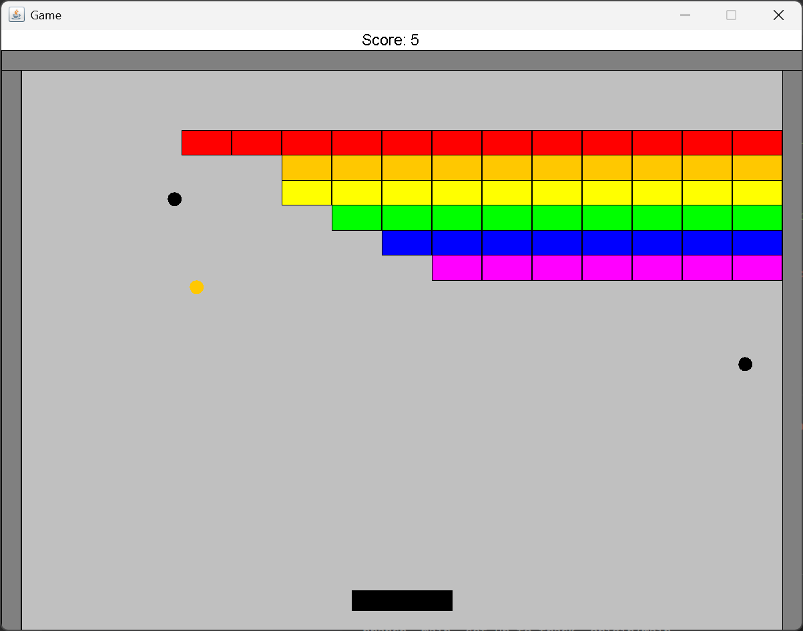
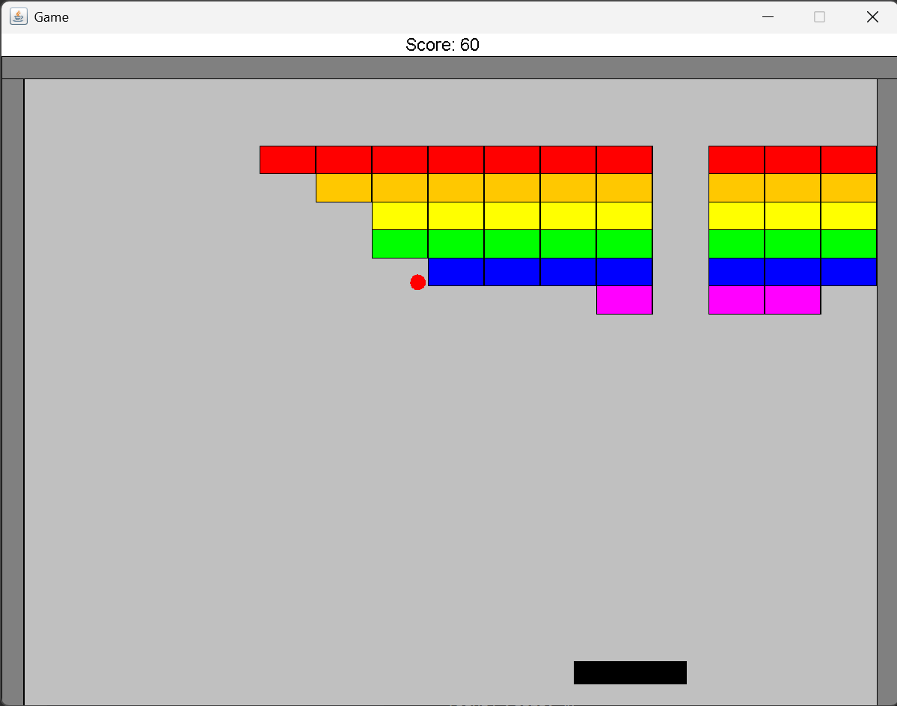
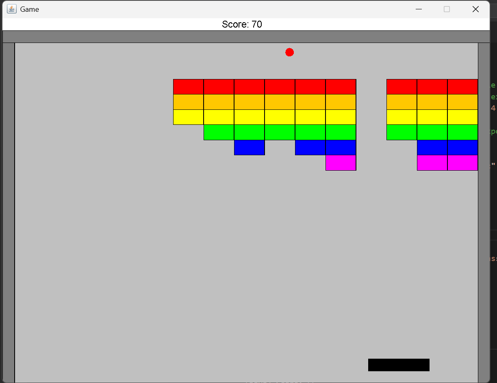

# Block_shooting_game

A 2D block shooting game implemented in Java as part of an Object-Oriented Programming course.  
The project focuses on clean OOP design, real-time game loop execution, collision detection, and event-driven architecture.

---

## 🎮 Game Overview
The game consists of a paddle controlled by the keyboard, a moving ball, and multiple blocks.
The player aims to destroy all blocks by bouncing the ball using the paddle while tracking the score.

---

## 🧠 Key Concepts & Design
- Real-time **game loop** with fixed frame rate
- **Collision detection** between ball, blocks, and paddle
- **Object-Oriented Design** using interfaces and polymorphism
- **Event/listener mechanism** for hit detection and score updates
- Clear separation between:
  - Game logic
  - Rendering
  - User input

---

## 🧱 Project Structure
- `Game` – manages the main game loop and rendering
- `Sprite` (interface) – represents any drawable and updatable object
- `Ball`, `Block`, `Paddle` – core game objects
- `SpriteCollection` – manages all sprites in the game
- `HitListener` & `ScoreTrackingListener` – event-driven hit handling

---

## 🛠 Technologies Used
- **Java**
- **Object-Oriented Programming**
- **Ant** (build & run automation)
- **biuoop** GUI library
- **Git & GitHub** for version control

---

## ⚙️ Build & Run
The project uses **Apache Ant** for compilation and execution.

```
bash
ant run
```

## 📸 Screenshots

Below are example screenshots of the game during runtime.






